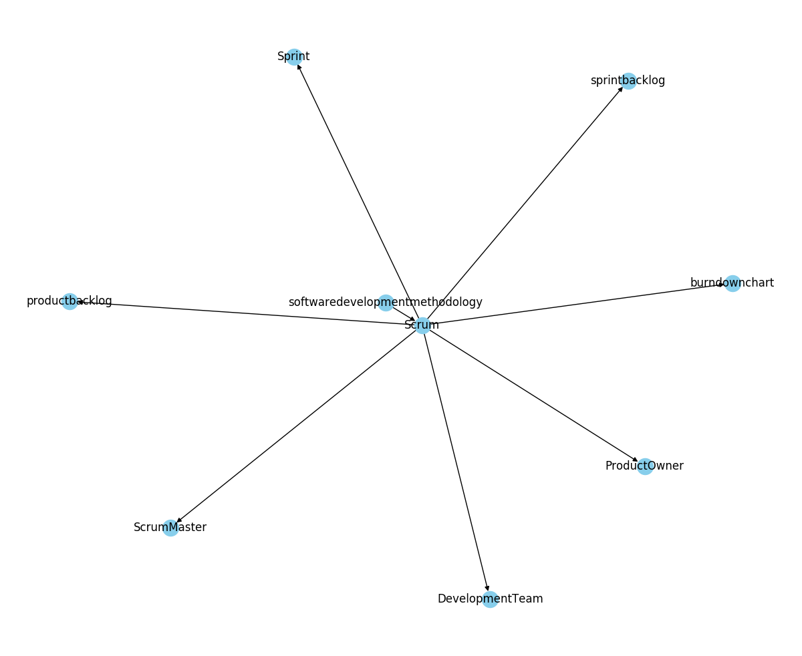
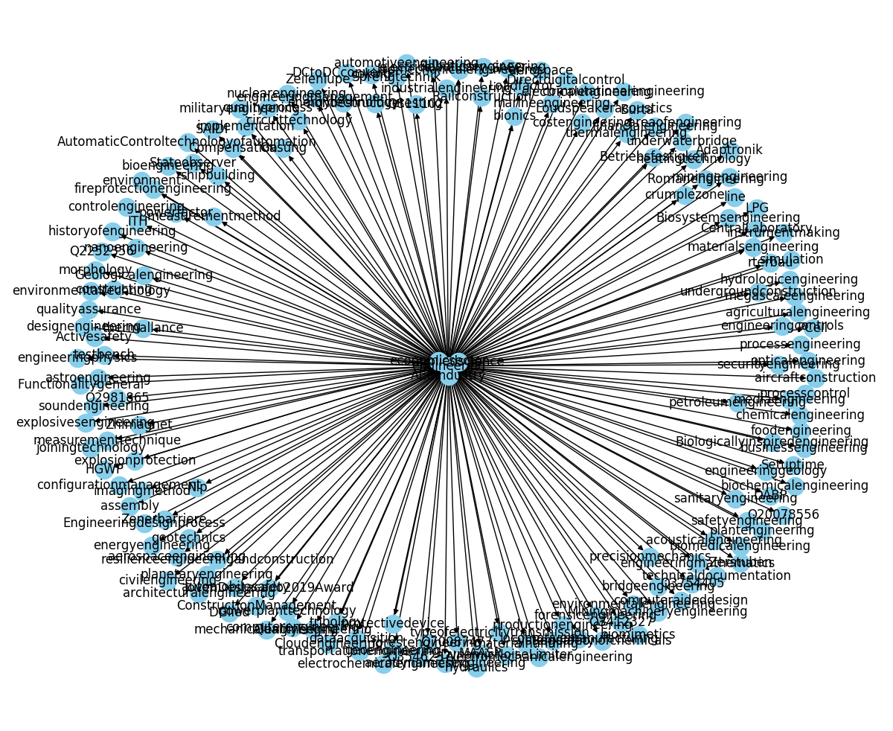

#WikiGraph

## What is it?

- A web-scraping tool that scrapes the Wiki-Data's Information and Tries to Represent in a Hierarchical Graph


## How to Use?

- First Clear the Existing Graph using the bash file `clear.sh`
- Then add the topic you want to be in the graph in `nodes.txt` file
- Simply import the draw() function from the cncpt_map.py file into your file
```python
from cncpt_map import draw
```
- See main.py for example!

## How It works?

- It picks up the node one by one from the file `nodes.txt`
- Searches them in WikiData and extract nodes related and within the hierarchy of each node
- Finally plot's them to give a good visual representation of the graph!

## Ouputs

- **Scrum**


- **Engineering**


